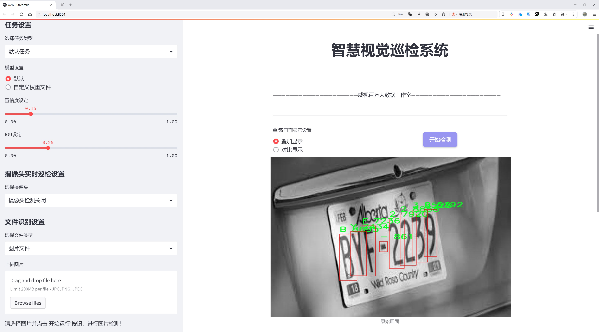
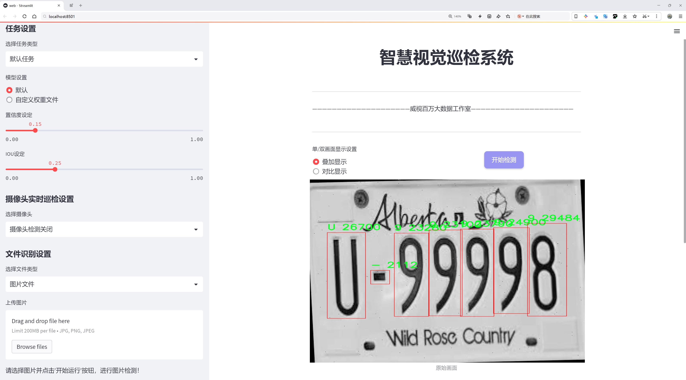
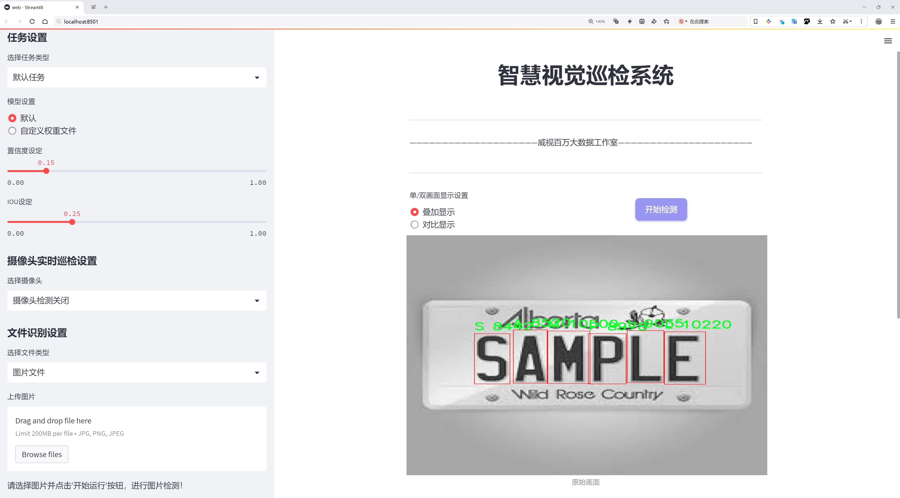
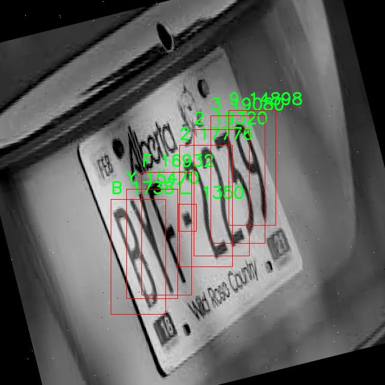
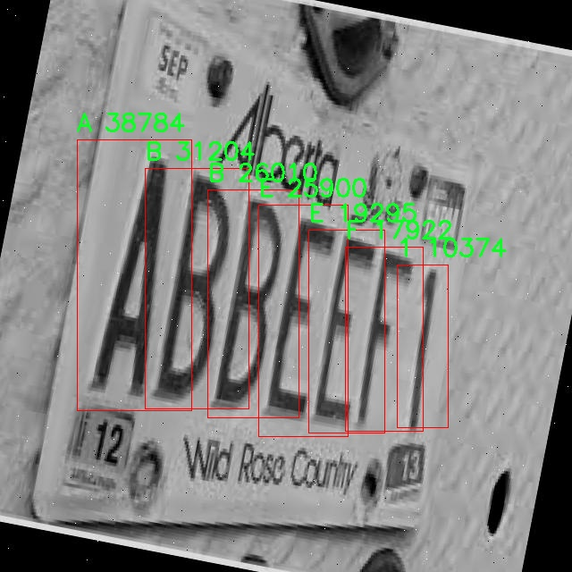
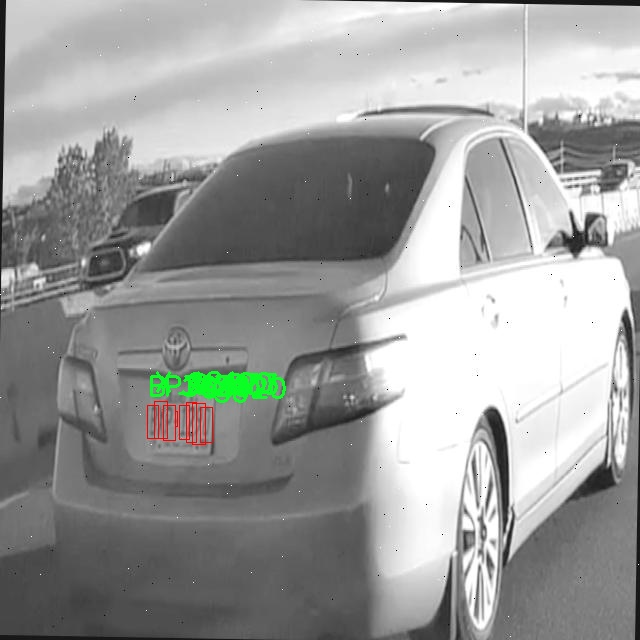

# 车牌字符识别检测系统源码分享
 # [一条龙教学YOLOV8标注好的数据集一键训练_70+全套改进创新点发刊_Web前端展示]

### 1.研究背景与意义

项目参考[AAAI Association for the Advancement of Artificial Intelligence](https://gitee.com/qunmasj/projects)

研究背景与意义

随着智能交通系统的快速发展，车牌识别技术在现代社会中扮演着越来越重要的角色。车牌识别不仅在交通管理、停车场管理、收费系统等领域得到了广泛应用，同时也在公共安全、智能监控等方面展现出其独特的价值。近年来，深度学习技术的迅猛发展为车牌字符识别提供了新的解决方案，其中YOLO（You Only Look Once）系列模型因其高效的实时检测能力而备受关注。YOLOv8作为该系列的最新版本，凭借其改进的网络结构和算法，能够在保持高精度的同时实现更快的检测速度，成为车牌字符识别的理想选择。

本研究旨在基于改进的YOLOv8模型，构建一个高效的车牌字符识别检测系统。我们使用的数据集包含9974张图像，涵盖了37个类别的字符，包括数字0-9和字母A-Z。这一丰富的字符集为模型的训练提供了良好的基础，使其能够在各种复杂场景下进行准确的车牌识别。通过对YOLOv8模型的改进，我们希望能够进一步提升其在车牌字符识别任务中的性能，尤其是在低光照、模糊、遮挡等不利条件下的识别能力。

车牌字符识别的准确性直接影响到智能交通系统的效率和安全性。传统的车牌识别方法往往依赖于手工特征提取和简单的分类器，难以应对复杂的实际应用场景。而基于深度学习的YOLOv8模型，能够通过自动学习特征，适应不同的环境变化，极大地提高了识别的鲁棒性和准确性。因此，改进YOLOv8模型的研究不仅具有理论意义，也具有重要的实际应用价值。

此外，随着车牌识别技术的不断普及，数据隐私和安全性问题也日益凸显。如何在保证识别准确性的同时，保护用户的隐私信息，成为亟待解决的课题。本研究将探索在车牌字符识别过程中，如何通过改进算法和数据处理方法，降低对用户隐私的影响，确保系统的安全性和可靠性。

综上所述，基于改进YOLOv8的车牌字符识别检测系统的研究，不仅为深度学习在车牌识别领域的应用提供了新的思路，也为推动智能交通系统的发展贡献了力量。通过优化模型性能、提升识别准确率以及保障数据安全性，本研究将为未来的智能交通解决方案奠定坚实的基础。我们相信，这一研究不仅能够推动相关技术的进步，还将为社会的交通管理和公共安全提供更为高效的支持。

### 2.图片演示







##### 注意：由于此博客编辑较早，上面“2.图片演示”和“3.视频演示”展示的系统图片或者视频可能为老版本，新版本在老版本的基础上升级如下：（实际效果以升级的新版本为准）

  （1）适配了YOLOV8的“目标检测”模型和“实例分割”模型，通过加载相应的权重（.pt）文件即可自适应加载模型。

  （2）支持“图片识别”、“视频识别”、“摄像头实时识别”三种识别模式。

  （3）支持“图片识别”、“视频识别”、“摄像头实时识别”三种识别结果保存导出，解决手动导出（容易卡顿出现爆内存）存在的问题，识别完自动保存结果并导出到。

  （4）支持Web前端系统中的标题、背景图等自定义修改，后面提供修改教程。

  另外本项目提供训练的数据集和训练教程,暂不提供权重文件（best.pt）,需要您按照教程进行训练后实现图片演示和Web前端界面演示的效果。

### 3.视频演示

[3.1 视频演示](https://www.bilibili.com/video/BV1i5WBenEPz/?vd_source=ff015de2d29cbe2a9cdbfa7064407a08)

### 4.数据集信息展示

数据集信息展示

在本研究中，我们使用了一个名为“plate-letter-recognition”的数据集，以改进YOLOv8的车牌字符识别检测系统。该数据集包含9974张图像，涵盖了37个类别，旨在提供丰富的样本以支持模型的训练和优化。数据集的设计充分考虑了车牌字符的多样性和复杂性，确保了模型在实际应用中的有效性和准确性。

数据集中包含的类别涵盖了数字和字母，具体包括0到9的数字以及A到Z的字母。这种广泛的类别设置使得模型能够识别各种车牌字符，满足不同地区和国家的车牌格式要求。通过使用这样的数据集，模型不仅能够学习到字符的基本形状和特征，还能适应不同的拍摄角度、光照条件和背景干扰，从而提高其在实际应用中的鲁棒性。

在图像数据的采集过程中，数据集的构建者注重多样性和代表性，确保图像来源于不同的环境和条件。这种多样性对于训练深度学习模型至关重要，因为它可以帮助模型学习到更广泛的特征，从而提高其泛化能力。每张图像都经过精心标注，确保字符的准确定位和分类，为后续的模型训练提供了坚实的基础。

此外，数据集的许可采用了CC BY 4.0，这意味着研究人员和开发者可以自由使用、修改和分发该数据集，只需给予适当的署名。这种开放的许可政策促进了学术界和工业界的合作与创新，使得更多的研究者能够在此基础上进行深入的研究和开发。

在使用YOLOv8进行车牌字符识别时，数据集的丰富性和多样性将直接影响模型的性能。YOLOv8作为一种先进的目标检测模型，具备快速和高效的特性，能够在实时场景中进行准确的字符识别。通过结合“plate-letter-recognition”数据集的训练，模型将能够更好地理解车牌字符的结构和特征，从而在实际应用中实现更高的识别率和更低的误识别率。

综上所述，“plate-letter-recognition”数据集为车牌字符识别检测系统的训练提供了重要的支持。其丰富的图像样本和多样的字符类别将为YOLOv8模型的优化奠定坚实的基础，推动车牌识别技术的发展。通过不断的实验和迭代，我们期待在未来的研究中，能够进一步提升模型的性能，为智能交通系统的建设贡献力量。









### 5.全套项目环境部署视频教程（零基础手把手教学）

[5.1 环境部署教程链接（零基础手把手教学）](https://www.ixigua.com/7404473917358506534?logTag=c807d0cbc21c0ef59de5)


[5.2 安装Python虚拟环境创建和依赖库安装视频教程链接（零基础手把手教学）](https://www.ixigua.com/7404474678003106304?logTag=1f1041108cd1f708b01a)

### 6.手把手YOLOV8训练视频教程（零基础小白有手就能学会）

[6.1 环境部署教程链接（零基础手把手教学）](https://www.ixigua.com/7404477157818401292?logTag=d31a2dfd1983c9668658)

### 7.70+种全套YOLOV8创新点代码加载调参视频教程（一键加载写好的改进模型的配置文件）

[7.1 环境部署教程链接（零基础手把手教学）](https://www.ixigua.com/7404478314661806627?logTag=29066f8288e3f4eea3a4)

### 8.70+种全套YOLOV8创新点原理讲解（非科班也可以轻松写刊发刊，V10版本正在科研待更新）

由于篇幅限制，每个创新点的具体原理讲解就不一一展开，具体见下列网址中的创新点对应子项目的技术原理博客网址【Blog】：


[8.1 70+种全套YOLOV8创新点原理讲解链接](https://gitee.com/qunmasj/good)

### 9.系统功能展示（检测对象为举例，实际内容以本项目数据集为准）

图1.系统支持检测结果表格显示

  图2.系统支持置信度和IOU阈值手动调节

  图3.系统支持自定义加载权重文件best.pt(需要你通过步骤5中训练获得)

  图4.系统支持摄像头实时识别

  图5.系统支持图片识别

  图6.系统支持视频识别

  图7.系统支持识别结果文件自动保存

  图8.系统支持Excel导出检测结果数据


### 10.原始YOLOV8算法原理

原始YOLOv8算法原理

YOLOv8是目标检测领域的最新进展，继承并发展了YOLO系列模型的优良传统。其设计理念旨在提高检测的准确性和速度，同时保持模型的轻量化，使其适用于各种实际应用场景。YOLOv8的结构可以分为输入层、主干网络、颈部网络和头部网络，这些组件共同协作，实现高效的目标检测。

在输入层，YOLOv8对输入图像进行缩放，以适应模型所需的输入尺寸。这一过程不仅是为了满足网络结构的要求，更是为了确保在不同分辨率下模型的鲁棒性。YOLOv8在数据增强方面也进行了优化，尤其是在训练的最后阶段停止使用Mosaic数据增强，以避免对数据真实分布的干扰，从而提高模型的泛化能力。

主干网络是YOLOv8的核心部分，采用了CSPDarknet结构，旨在高效提取图像特征。与前代模型YOLOv5相比，YOLOv8将C3模块替换为C2f模块，这一创新设计引入了更多的跳层连接，显著增强了模型的梯度流信息。C2f模块通过将输入特征图分为两个分支，分别经过卷积层进行降维处理，并在输出时将各分支的结果进行融合，从而形成更高维度的特征图。这种设计不仅提升了特征提取的能力，还有效减少了计算量和参数量，使得模型在保持性能的同时更加轻量化。

在主干网络的末尾，YOLOv8引入了快速空间金字塔池化（SPPF）结构，通过多个最大池化层处理多尺度特征。这一设计使得模型能够在不同尺度上提取信息，增强了特征的抽象能力，为后续的目标检测提供了更为丰富的特征表示。

颈部网络的设计同样至关重要，YOLOv8采用了特征金字塔网络（FPN）和路径聚合网络（PAN）的结合，旨在有效融合不同尺度的特征图信息。通过多层卷积和池化操作，颈部网络将提取到的特征进行压缩和整合，确保在目标检测过程中，模型能够充分利用各层特征的优势。

头部网络是YOLOv8的最后一环，其采用了解耦的检测头设计，分别处理类别和位置特征。这样的设计理念源于YOLOX的思路，通过两个并行的分支来优化分类和定位任务。分类任务侧重于分析特征图中提取到的特征与已知类别的相似性，而定位任务则关注边界框与真实框之间的关系。通过这种方式，YOLOv8在收敛速度和预测精度上均有显著提升。

值得一提的是，YOLOv8采用了无锚框（Anchor-Free）的检测方式，直接预测目标的中心点和宽高比例。这一创新减少了对Anchor框的依赖，简化了模型的设计，同时提高了检测速度和准确度。此外，YOLOv8引入了任务对齐学习（TAL）机制，通过引入分类分数和IOU的高次幂乘积作为衡量任务对齐程度的指标，进一步优化了分类和定位的损失函数，使得模型在定位和分类上都能取得更好的表现。

在性能方面，YOLOv8在COCO数据集上的表现令人瞩目。通过对比不同尺寸的模型，YOLOv8在参数量没有显著增加的情况下，取得了更高的mAP（mean Average Precision）值。这一结果表明，YOLOv8在保持轻量化的同时，显著提升了检测的准确性。此外，YOLOv8在推理速度上也表现优异，能够满足实时检测的需求，尤其适合于需要快速响应的应用场景，如自动驾驶、安防监控等。

总的来说，YOLOv8通过一系列创新设计和结构优化，提升了目标检测的效率和准确性。其在特征提取、特征融合和目标检测等方面的改进，使得YOLOv8成为当前目标检测领域的一项重要进展，具有广泛的研究和应用价值。随着技术的不断发展，YOLOv8有望在更多实际应用中发挥其优势，推动目标检测技术的进一步发展。


### 11.项目核心源码讲解（再也不用担心看不懂代码逻辑）

#### 11.1 ui.py

以下是经过精简和注释的核心代码部分：

```python
import sys
import subprocess

def run_script(script_path):
    """
    使用当前 Python 环境运行指定的脚本。

    Args:
        script_path (str): 要运行的脚本路径
    """
    # 获取当前 Python 解释器的路径
    python_path = sys.executable

    # 构建运行命令，使用 streamlit 运行指定的脚本
    command = f'"{python_path}" -m streamlit run "{script_path}"'

    # 执行命令并等待其完成
    result = subprocess.run(command, shell=True)
    
    # 检查命令执行结果，如果返回码不为0，表示出错
    if result.returncode != 0:
        print("脚本运行出错。")

# 程序入口
if __name__ == "__main__":
    # 指定要运行的脚本路径
    script_path = "web.py"  # 这里可以直接使用相对路径

    # 调用函数运行脚本
    run_script(script_path)
```

### 代码注释说明：
1. **导入模块**：
   - `sys`：用于获取当前 Python 解释器的路径。
   - `subprocess`：用于执行外部命令。

2. **`run_script` 函数**：
   - 接受一个参数 `script_path`，表示要运行的 Python 脚本的路径。
   - 使用 `sys.executable` 获取当前 Python 解释器的路径。
   - 构建一个命令字符串，使用 `streamlit` 模块运行指定的脚本。
   - 使用 `subprocess.run` 执行命令，并等待其完成。
   - 检查命令的返回码，如果不为0，则打印错误信息。

3. **程序入口**：
   - 使用 `if __name__ == "__main__":` 确保代码仅在直接运行时执行。
   - 指定要运行的脚本路径（在这里为 `web.py`）。
   - 调用 `run_script` 函数来执行指定的脚本。

这个文件是一个 Python 脚本，主要功能是运行一个名为 `web.py` 的脚本。首先，它导入了几个必要的模块，包括 `sys`、`os` 和 `subprocess`，这些模块分别用于系统相关的操作、文件路径处理和执行外部命令。

在文件的开头，定义了一个名为 `run_script` 的函数，该函数接受一个参数 `script_path`，表示要运行的脚本的路径。函数内部首先获取当前 Python 解释器的路径，使用 `sys.executable` 来实现。接着，构建一个命令字符串，这个命令将使用 `streamlit` 来运行指定的脚本。具体来说，命令的格式是 `"{python_path}" -m streamlit run "{script_path}"`，其中 `python_path` 是当前 Python 解释器的路径，`script_path` 是传入的脚本路径。

然后，使用 `subprocess.run` 方法来执行这个命令。这个方法会在一个新的 shell 中运行命令，并等待命令执行完成。如果命令执行的返回码不为 0，表示执行过程中出现了错误，程序会打印出“脚本运行出错。”的提示信息。

在文件的最后部分，使用 `if __name__ == "__main__":` 这一结构来确保只有在直接运行该脚本时才会执行后面的代码。这里指定了要运行的脚本路径为 `web.py`，并调用 `run_script` 函数来执行这个脚本。

总体来说，这个脚本的主要作用是为 `web.py` 提供一个运行环境，通过 `streamlit` 框架来启动一个 Web 应用。

#### 11.2 ultralytics\data\augment.py

以下是经过简化和注释的核心代码部分，主要包括了图像变换的基础类和一些具体的变换实现。

```python
import numpy as np
import random
import cv2

class BaseTransform:
    """
    图像变换的基础类，提供了一些通用的变换方法。
    """

    def __init__(self) -> None:
        """初始化基础变换对象。"""
        pass

    def apply_image(self, labels):
        """应用图像变换到标签。"""
        pass

    def apply_instances(self, labels):
        """应用变换到标签中的对象实例。"""
        pass

    def apply_semantic(self, labels):
        """应用语义分割到图像。"""
        pass

    def __call__(self, labels):
        """应用所有标签变换到图像、实例和语义掩码。"""
        self.apply_image(labels)
        self.apply_instances(labels)
        self.apply_semantic(labels)


class Compose:
    """
    组合多个图像变换的类。
    """

    def __init__(self, transforms):
        """初始化组合对象，接收变换列表。"""
        self.transforms = transforms

    def __call__(self, data):
        """依次应用变换到输入数据。"""
        for t in self.transforms:
            data = t(data)
        return data


class RandomFlip:
    """
    随机水平或垂直翻转图像的类。
    """

    def __init__(self, p=0.5, direction="horizontal") -> None:
        """
        初始化随机翻转对象。

        Args:
            p (float): 翻转的概率，范围在0到1之间。
            direction (str): 翻转方向，支持'horizontal'或'vertical'。
        """
        assert direction in ["horizontal", "vertical"], "支持的方向为'horizontal'或'vertical'"
        assert 0 <= p <= 1.0

        self.p = p
        self.direction = direction

    def __call__(self, labels):
        """
        应用随机翻转到图像，并相应更新实例。

        Args:
            labels (dict): 包含'img'和'instances'的字典。
        """
        img = labels["img"]
        instances = labels.pop("instances")  # 提取实例
        h, w = img.shape[:2]

        # 随机垂直翻转
        if self.direction == "vertical" and random.random() < self.p:
            img = np.flipud(img)
            instances.flipud(h)  # 更新实例

        # 随机水平翻转
        if self.direction == "horizontal" and random.random() < self.p:
            img = np.fliplr(img)
            instances.fliplr(w)  # 更新实例

        labels["img"] = img
        labels["instances"] = instances
        return labels


class LetterBox:
    """
    用于图像检测、实例分割和姿态估计的图像调整和填充类。
    """

    def __init__(self, new_shape=(640, 640), auto=False, stride=32):
        """初始化LetterBox对象，设置目标形状和其他参数。"""
        self.new_shape = new_shape
        self.auto = auto
        self.stride = stride

    def __call__(self, labels=None, image=None):
        """返回更新后的标签和图像，添加边框。"""
        img = labels.get("img") if image is None else image
        shape = img.shape[:2]  # 当前形状 [高度, 宽度]
        new_shape = self.new_shape

        # 计算缩放比例
        r = min(new_shape[0] / shape[0], new_shape[1] / shape[1])
        new_unpad = int(round(shape[1] * r)), int(round(shape[0] * r))
        dw, dh = new_shape[1] - new_unpad[0], new_shape[0] - new_unpad[1]  # 计算填充

        # 中心填充
        dw /= 2
        dh /= 2

        # 调整图像大小
        img = cv2.resize(img, new_unpad, interpolation=cv2.INTER_LINEAR)
        top, bottom = int(round(dh)), int(round(dh))
        left, right = int(round(dw)), int(round(dw))
        img = cv2.copyMakeBorder(img, top, bottom, left, right, cv2.BORDER_CONSTANT, value=(114, 114, 114))  # 添加边框

        labels["img"] = img
        labels["resized_shape"] = new_shape
        return labels
```

### 代码说明：
1. **BaseTransform**: 基础变换类，定义了应用图像、实例和语义的接口。
2. **Compose**: 组合多个变换的类，可以将多个变换按顺序应用到数据上。
3. **RandomFlip**: 随机翻转图像的类，支持水平和垂直翻转，并更新实例的坐标。
4. **LetterBox**: 用于调整图像大小并添加边框的类，适用于目标检测和实例分割任务。它会根据目标形状计算填充，并调整图像大小。

这个程序文件 `ultralytics\data\augment.py` 是用于图像增强的模块，主要用于 YOLO（You Only Look Once）目标检测模型的训练和推理。该文件包含多个类和函数，用于实现不同的图像增强技术，以提高模型的鲁棒性和泛化能力。

首先，文件中定义了一个 `BaseTransform` 类，这是一个基类，用于图像转换。它包含一些方法，例如 `apply_image`、`apply_instances` 和 `apply_semantic`，这些方法可以被子类重写以实现特定的图像处理需求。该类的实例可以通过 `__call__` 方法来应用所有标签转换。

接下来是 `Compose` 类，它用于组合多个图像转换。这个类的 `__call__` 方法会依次应用所有的转换，返回处理后的数据。它还提供了 `append` 方法来添加新的转换，以及 `tolist` 方法将转换列表转换为标准的 Python 列表。

`BaseMixTransform` 类是一个基类，用于实现混合增强（如 MixUp 和 Mosaic）。它的 `__call__` 方法会根据一定的概率应用预处理和混合转换。具体的混合增强实现则在其子类中完成，例如 `Mosaic` 和 `MixUp` 类。

`Mosaic` 类实现了马赛克增强，通过将多个图像（通常是 4 或 9 张）组合成一张马赛克图像。该类的构造函数接受数据集、图像大小、应用概率和网格大小等参数。`get_indexes` 方法用于获取随机索引，`_mix_transform` 方法则根据网格大小选择相应的马赛克方法（如 `_mosaic3`、`_mosaic4` 和 `_mosaic9`）来生成最终的马赛克图像。

`MixUp` 类则实现了 MixUp 增强，通过对两张图像进行加权平均来生成新的图像。它的 `get_indexes` 方法返回一个随机索引，`_mix_transform` 方法则执行 MixUp 操作。

`RandomPerspective` 类实现了随机透视变换和仿射变换，支持旋转、平移、缩放和剪切等操作。它的 `__call__` 方法会对输入的图像和标签进行变换，并更新边界框、分割和关键点。

`RandomHSV` 类用于随机调整图像的色调、饱和度和亮度。`RandomFlip` 类则实现了随机水平或垂直翻转图像，并相应更新实例（如边界框和关键点）。

`LetterBox` 类用于调整图像大小并添加边框，以适应目标检测和实例分割的需求。`CopyPaste` 类实现了图像的复制粘贴增强，适用于增强实例分割的效果。

`Albumentations` 类提供了一系列基于 Albumentations 库的增强方法，包括模糊、对比度自适应直方图均衡、随机亮度和对比度变化等。

最后，`Format` 类用于格式化图像注释，以便在 PyTorch 的 DataLoader 中使用。它标准化图像和实例注释，返回适合批处理的格式。

文件的最后部分定义了一些用于分类任务的增强函数，包括 `classify_transforms` 和 `classify_augmentations`，这些函数使用 torchvision 库中的转换方法来处理图像。

总体而言，这个文件提供了丰富的图像增强方法，可以有效地提高 YOLO 模型在目标检测任务中的性能。

#### 11.3 ultralytics\nn\modules\conv.py

以下是经过简化并添加详细中文注释的核心代码部分：

```python
import math
import torch
import torch.nn as nn

def autopad(k, p=None, d=1):  # kernel, padding, dilation
    """自动计算填充以保持输出形状不变。"""
    if d > 1:
        # 如果有膨胀(dilation)，计算实际的卷积核大小
        k = d * (k - 1) + 1 if isinstance(k, int) else [d * (x - 1) + 1 for x in k]
    if p is None:
        # 如果没有指定填充，自动计算填充为卷积核大小的一半
        p = k // 2 if isinstance(k, int) else [x // 2 for x in k]
    return p

class Conv(nn.Module):
    """标准卷积层，包含卷积、批归一化和激活函数。"""

    default_act = nn.SiLU()  # 默认激活函数

    def __init__(self, c1, c2, k=1, s=1, p=None, g=1, d=1, act=True):
        """初始化卷积层，参数包括输入通道数、输出通道数、卷积核大小、步幅、填充、分组、膨胀和激活函数。"""
        super().__init__()
        # 创建卷积层
        self.conv = nn.Conv2d(c1, c2, k, s, autopad(k, p, d), groups=g, dilation=d, bias=False)
        # 创建批归一化层
        self.bn = nn.BatchNorm2d(c2)
        # 根据参数选择激活函数
        self.act = self.default_act if act is True else act if isinstance(act, nn.Module) else nn.Identity()

    def forward(self, x):
        """前向传播：应用卷积、批归一化和激活函数。"""
        return self.act(self.bn(self.conv(x)))

class DWConv(Conv):
    """深度可分离卷积层。"""

    def __init__(self, c1, c2, k=1, s=1, d=1, act=True):
        """初始化深度可分离卷积层，参数包括输入通道数、输出通道数、卷积核大小、步幅、膨胀和激活函数。"""
        super().__init__(c1, c2, k, s, g=math.gcd(c1, c2), d=d, act=act)

class ChannelAttention(nn.Module):
    """通道注意力模块。"""

    def __init__(self, channels: int) -> None:
        """初始化通道注意力模块，设置基本配置。"""
        super().__init__()
        self.pool = nn.AdaptiveAvgPool2d(1)  # 自适应平均池化
        self.fc = nn.Conv2d(channels, channels, 1, 1, 0, bias=True)  # 1x1卷积
        self.act = nn.Sigmoid()  # 激活函数

    def forward(self, x: torch.Tensor) -> torch.Tensor:
        """前向传播：计算通道注意力并与输入相乘。"""
        return x * self.act(self.fc(self.pool(x)))

class SpatialAttention(nn.Module):
    """空间注意力模块。"""

    def __init__(self, kernel_size=7):
        """初始化空间注意力模块，设置卷积核大小。"""
        super().__init__()
        assert kernel_size in (3, 7), "卷积核大小必须为3或7"
        padding = 3 if kernel_size == 7 else 1
        self.cv1 = nn.Conv2d(2, 1, kernel_size, padding=padding, bias=False)  # 卷积层
        self.act = nn.Sigmoid()  # 激活函数

    def forward(self, x):
        """前向传播：计算空间注意力并与输入相乘。"""
        return x * self.act(self.cv1(torch.cat([torch.mean(x, 1, keepdim=True), torch.max(x, 1, keepdim=True)[0]], 1)))

class CBAM(nn.Module):
    """卷积块注意力模块。"""

    def __init__(self, c1, kernel_size=7):
        """初始化CBAM模块，设置输入通道和卷积核大小。"""
        super().__init__()
        self.channel_attention = ChannelAttention(c1)  # 通道注意力
        self.spatial_attention = SpatialAttention(kernel_size)  # 空间注意力

    def forward(self, x):
        """前向传播：依次应用通道注意力和空间注意力。"""
        return self.spatial_attention(self.channel_attention(x))
```

### 代码说明
1. **autopad**: 该函数用于自动计算卷积操作所需的填充，以确保输出的空间维度与输入相同。
2. **Conv**: 这是一个标准的卷积层，包含卷积操作、批归一化和激活函数。构造函数接受多个参数来配置卷积层的行为。
3. **DWConv**: 继承自`Conv`，实现深度可分离卷积，通常用于减少模型参数和计算量。
4. **ChannelAttention**: 实现通道注意力机制，通过自适应平均池化和1x1卷积来增强特征图的通道信息。
5. **SpatialAttention**: 实现空间注意力机制，通过对输入特征图进行平均和最大池化，然后进行卷积，强调重要的空间区域。
6. **CBAM**: 结合通道注意力和空间注意力的模块，依次应用这两种注意力机制来增强特征图。

以上是代码的核心部分及其详细注释，旨在帮助理解每个模块的功能和实现方式。

这个程序文件是一个用于实现卷积模块的代码，主要用于Ultralytics YOLO（You Only Look Once）模型的构建。文件中定义了多个卷积相关的类和函数，以下是对其主要内容的说明。

首先，文件导入了必要的库，包括数学库、NumPy和PyTorch。接着，定义了一个名为`autopad`的函数，用于根据卷积核的大小、填充和扩张率自动计算填充量，以确保输出形状与输入形状相同。

接下来，定义了多个卷积模块的类。`Conv`类是一个标准的卷积层，包含卷积操作、批归一化和激活函数。它的构造函数接受多个参数，包括输入通道数、输出通道数、卷积核大小、步幅、填充、分组和扩张率。`forward`方法执行卷积、批归一化和激活操作。

`Conv2`类是对`Conv`类的简化版本，增加了一个1x1的卷积层，并在前向传播中将两个卷积的输出相加。它还包含一个`fuse_convs`方法，用于将并行卷积融合为一个卷积。

`LightConv`类实现了一种轻量级卷积结构，包含两个卷积层，分别为1x1卷积和深度卷积。`DWConv`类实现了深度卷积，适用于通道数较大的情况。

`DWConvTranspose2d`类是深度转置卷积的实现，`ConvTranspose`类则实现了转置卷积层，包含批归一化和激活函数。

`Focus`类用于将空间信息聚焦到通道维度，通过对输入张量进行拼接和卷积操作来实现。`GhostConv`类实现了Ghost卷积，这是一种通过使用较少的参数实现高效卷积的方法。

`RepConv`类是一个基本的重复卷积块，支持训练和推理状态，包含多个卷积层和可选的批归一化。它还提供了融合卷积的功能，以减少推理时的计算量。

此外，文件中还定义了几个注意力机制模块，包括`ChannelAttention`和`SpatialAttention`，用于增强特征图的表示能力。`CBAM`类结合了通道注意力和空间注意力，形成了一个完整的卷积块注意力模块。

最后，`Concat`类用于在指定维度上连接多个张量，常用于特征融合。

总体而言，这个文件实现了多种卷积操作和注意力机制，旨在提高YOLO模型的性能和效率。每个模块都具有灵活的参数设置，适用于不同的网络架构和任务需求。

#### 11.4 ultralytics\models\yolo\detect\predict.py

以下是经过简化和注释的核心代码部分：

```python
# 导入必要的模块
from ultralytics.engine.predictor import BasePredictor
from ultralytics.engine.results import Results
from ultralytics.utils import ops

class DetectionPredictor(BasePredictor):
    """
    DetectionPredictor类，继承自BasePredictor，用于基于检测模型进行预测。
    """

    def postprocess(self, preds, img, orig_imgs):
        """
        对预测结果进行后处理，并返回Results对象的列表。

        参数:
        preds: 模型的预测结果
        img: 输入图像
        orig_imgs: 原始图像列表

        返回:
        results: 包含后处理结果的Results对象列表
        """
        # 应用非极大值抑制（NMS）来过滤预测框
        preds = ops.non_max_suppression(
            preds,
            self.args.conf,  # 置信度阈值
            self.args.iou,    # IOU阈值
            agnostic=self.args.agnostic_nms,  # 是否使用类别无关的NMS
            max_det=self.args.max_det,  # 最大检测框数量
            classes=self.args.classes,  # 需要检测的类别
        )

        # 如果输入的原始图像不是列表，则将其转换为numpy数组
        if not isinstance(orig_imgs, list):
            orig_imgs = ops.convert_torch2numpy_batch(orig_imgs)

        results = []  # 存储结果的列表
        for i, pred in enumerate(preds):
            orig_img = orig_imgs[i]  # 获取对应的原始图像
            # 将预测框的坐标缩放到原始图像的尺寸
            pred[:, :4] = ops.scale_boxes(img.shape[2:], pred[:, :4], orig_img.shape)
            img_path = self.batch[0][i]  # 获取图像路径
            # 创建Results对象并添加到结果列表中
            results.append(Results(orig_img, path=img_path, names=self.model.names, boxes=pred))
        
        return results  # 返回处理后的结果列表
```

### 代码注释说明：
1. **导入模块**：引入必要的类和函数以便后续使用。
2. **DetectionPredictor类**：这是一个用于进行目标检测预测的类，继承自基础预测类`BasePredictor`。
3. **postprocess方法**：这是处理模型预测结果的核心方法，主要完成以下任务：
   - 应用非极大值抑制（NMS）来减少重叠的预测框。
   - 将原始图像转换为numpy数组（如果不是列表的话）。
   - 遍历每个预测结果，缩放预测框的坐标到原始图像的尺寸，并创建结果对象。
4. **返回结果**：最终返回包含所有处理后结果的列表。

这个程序文件是Ultralytics YOLO模型中的一个预测模块，主要用于基于检测模型进行目标检测的预测。文件中定义了一个名为`DetectionPredictor`的类，它继承自`BasePredictor`类。这个类的主要功能是处理输入图像，执行目标检测，并对检测结果进行后处理。

在类的文档字符串中，提供了一个使用示例，展示了如何实例化`DetectionPredictor`并调用其`predict_cli`方法进行预测。示例中，首先从`ultralytics.utils`导入了`ASSETS`，然后定义了一个包含模型路径和数据源的参数字典`args`。接着，创建了`DetectionPredictor`的实例，并通过`predict_cli`方法进行预测。

类中有一个名为`postprocess`的方法，负责对模型的预测结果进行后处理。该方法接收三个参数：`preds`（模型的预测结果）、`img`（输入图像）和`orig_imgs`（原始图像）。在方法内部，首先调用`ops.non_max_suppression`函数对预测结果进行非极大值抑制，以去除冗余的检测框。这个函数使用了一些参数，如置信度阈值、IOU阈值、是否进行类别无关的NMS、最大检测框数量和指定的类别。

接下来，方法检查输入的原始图像是否为列表，如果不是，则将其转换为NumPy数组格式。然后，创建一个空的结果列表`results`，用于存储处理后的结果。通过遍历每个预测结果，方法会对预测框进行缩放，以适应原始图像的尺寸，并将每个结果封装为`Results`对象，包含原始图像、图像路径、模型的类别名称和检测框信息。最后，返回处理后的结果列表。

整体来看，这个文件实现了YOLO模型的预测功能，并提供了后处理的能力，以便将模型的输出转换为可用的结果格式。

#### 11.5 train.py

以下是代码中最核心的部分，并附上详细的中文注释：

```python
import os
import torch
import yaml
from ultralytics import YOLO  # 导入YOLO模型库
from QtFusion.path import abs_path  # 导入路径处理函数

# 检测是否有可用的GPU，如果有则使用GPU，否则使用CPU
device = "0" if torch.cuda.is_available() else "cpu"

if __name__ == '__main__':  # 确保该模块被直接运行时才执行以下代码
    workers = 1  # 设置数据加载的工作进程数
    batch = 2    # 设置每个批次的大小

    data_name = "data"  # 数据集名称
    # 获取数据集的yaml配置文件的绝对路径
    data_path = abs_path(f'datasets/{data_name}/{data_name}.yaml', path_type='current')  
    unix_style_path = data_path.replace(os.sep, '/')  # 将路径转换为Unix风格

    # 获取数据集目录的路径
    directory_path = os.path.dirname(unix_style_path)
    
    # 读取YAML文件，保持原有顺序
    with open(data_path, 'r') as file:
        data = yaml.load(file, Loader=yaml.FullLoader)
    
    # 如果YAML文件中包含'path'项，则修改为当前目录路径
    if 'path' in data:
        data['path'] = directory_path
        # 将修改后的数据写回YAML文件
        with open(data_path, 'w') as file:
            yaml.safe_dump(data, file, sort_keys=False)

    # 加载预训练的YOLOv8模型
    model = YOLO(model='./ultralytics/cfg/models/v8/yolov8s.yaml', task='detect')  
    
    # 开始训练模型
    results2 = model.train(  
        data=data_path,  # 指定训练数据的配置文件路径
        device=device,  # 指定使用的设备（GPU或CPU）
        workers=workers,  # 指定数据加载的工作进程数
        imgsz=640,  # 指定输入图像的大小为640x640
        epochs=100,  # 指定训练的轮数为100
        batch=batch,  # 指定每个批次的大小
        name='train_v8_' + data_name  # 指定训练任务的名称
    )
```

### 代码注释说明：
1. **导入库**：导入必要的库，包括`os`、`torch`、`yaml`和YOLO模型库。
2. **设备选择**：根据是否有可用的GPU选择计算设备。
3. **主程序入口**：确保代码在直接运行时执行。
4. **数据集配置**：定义数据集名称并获取相应的YAML配置文件路径。
5. **路径处理**：将路径转换为Unix风格，以便在不同操作系统上使用。
6. **读取和修改YAML文件**：读取YAML文件内容，修改其中的`path`项为当前目录路径，并将修改后的内容写回文件。
7. **模型加载**：加载预训练的YOLOv8模型，准备进行训练。
8. **模型训练**：使用指定的参数开始训练模型，包括数据路径、设备、工作进程数、图像大小、训练轮数和批次大小等。

这个程序文件 `train.py` 是用于训练 YOLOv8 模型的 Python 脚本。首先，它导入了必要的库，包括 `os`、`torch`、`yaml` 和 `ultralytics` 中的 YOLO 模型。接着，程序会根据是否有可用的 GPU 来设置设备，若有则使用 GPU（设备编号为 "0"），否则使用 CPU。

在 `__main__` 块中，程序首先定义了一些训练参数，如工作进程数 `workers` 和批次大小 `batch`。然后，它指定了数据集的名称为 "data"，并构建了数据集 YAML 文件的绝对路径。接下来，程序将路径中的分隔符统一为 Unix 风格的斜杠。

程序获取了数据集目录的路径，并打开指定的 YAML 文件以读取数据。它使用 `yaml` 库来解析 YAML 文件，并保持原有的顺序。如果 YAML 文件中包含 `path` 项，程序会将其修改为数据集的目录路径，并将更新后的数据写回到 YAML 文件中。

接下来，程序加载了预训练的 YOLOv8 模型，指定了模型的配置文件。然后，它调用 `model.train()` 方法开始训练模型。在训练过程中，程序指定了训练数据的配置文件路径、设备、工作进程数、输入图像的大小（640x640）、训练的 epoch 数（100）以及训练任务的名称（由 "train_v8_" 和数据集名称组合而成）。

总体来说，这个脚本的主要功能是设置训练环境、准备数据集，并启动 YOLOv8 模型的训练过程。

#### 11.6 ui_style.py

以下是代码中最核心的部分，并附上详细的中文注释：

```python
import base64  # 导入base64模块，用于进行Base64编码
import streamlit as st  # 导入Streamlit库，用于构建Web应用

# 读取图片并转换为 Base64
def get_base64_of_bin_file(bin_file):
    # 以二进制模式打开文件
    with open(bin_file, 'rb') as file:
        data = file.read()  # 读取文件内容
    # 将读取的二进制数据进行Base64编码，并返回字符串形式
    return base64.b64encode(data).decode()

# 定义CSS样式
def def_css_hitml():
    # 使用Streamlit的markdown功能注入自定义CSS样式
    st.markdown("""
        <style>
        /* 全局样式 */
        .css-2trqyj, .css-1d391kg, .st-bb, .st-at {
            font-family: 'Gill Sans', 'Gill Sans MT', Calibri, 'Trebuchet MS', sans-serif;  /* 设置字体 */
            background-color: #cadefc;  /* 设置背景颜色 */
            color: #21618C;  /* 设置字体颜色 */
        }

        /* 按钮样式 */
        .stButton > button {
            border: none;  /* 去掉按钮边框 */
            color: white;  /* 设置按钮文字颜色 */
            padding: 10px 20px;  /* 设置按钮内边距 */
            text-align: center;  /* 文本居中 */
            text-decoration: none;  /* 去掉文本装饰 */
            display: inline-block;  /* 使按钮为块级元素 */
            font-size: 16px;  /* 设置字体大小 */
            margin: 2px 1px;  /* 设置按钮外边距 */
            cursor: pointer;  /* 鼠标悬停时显示为手型 */
            border-radius: 8px;  /* 设置按钮圆角 */
            background-color: #9896f1;  /* 设置按钮背景颜色 */
            box-shadow: 0 2px 4px 0 rgba(0,0,0,0.2);  /* 设置按钮阴影 */
            transition-duration: 0.4s;  /* 设置过渡效果时长 */
        }
        .stButton > button:hover {
            background-color: #5499C7;  /* 鼠标悬停时改变背景颜色 */
            color: white;  /* 鼠标悬停时保持文字颜色 */
            box-shadow: 0 8px 12px 0 rgba(0,0,0,0.24);  /* 鼠标悬停时改变阴影 */
        }

        /* 侧边栏样式 */
        .css-1lcbmhc.e1fqkh3o0 {
            background-color: #154360;  /* 设置侧边栏背景颜色 */
            color: #FDFEFE;  /* 设置侧边栏文字颜色 */
            border-right: 2px solid #DDD;  /* 设置右边框 */
        }

        /* Radio 按钮样式 */
        .stRadio > label {
            display: inline-flex;  /* 使标签为弹性盒子布局 */
            align-items: center;  /* 垂直居中对齐 */
            cursor: pointer;  /* 鼠标悬停时显示为手型 */
        }
        .stRadio > label > span:first-child {
            background-color: #FFF;  /* 设置Radio按钮背景颜色 */
            border: 1px solid #CCC;  /* 设置边框 */
            width: 1em;  /* 设置宽度 */
            height: 1em;  /* 设置高度 */
            border-radius: 50%;  /* 设置圆形 */
            margin-right: 10px;  /* 设置右边距 */
            display: inline-block;  /* 使其为块级元素 */
        }

        /* 滑块样式 */
        .stSlider .thumb {
            background-color: #2E86C1;  /* 设置滑块颜色 */
        }
        .stSlider .track {
            background-color: #DDD;  /* 设置滑轨颜色 */
        }

        /* 表格样式 */
        table {
            border-collapse: collapse;  /* 合并边框 */
            margin: 25px 0;  /* 设置外边距 */
            font-size: 18px;  /* 设置字体大小 */
            font-family: sans-serif;  /* 设置字体 */
            min-width: 400px;  /* 设置最小宽度 */
            box-shadow: 0 5px 15px rgba(0, 0, 0, 0.2);  /* 设置阴影 */
        }
        thead tr {
            background-color: #a8d8ea;  /* 设置表头背景颜色 */
            color: #ffcef3;  /* 设置表头文字颜色 */
            text-align: left;  /* 设置文本左对齐 */
        }
        th, td {
            padding: 15px 18px;  /* 设置单元格内边距 */
        }
        tbody tr {
            border-bottom: 2px solid #ddd;  /* 设置行底部边框 */
        }
        tbody tr:nth-of-type(even) {
            background-color: #D6EAF8;  /* 设置偶数行背景颜色 */
        }
        tbody tr:last-of-type {
            border-bottom: 3px solid #5499C7;  /* 设置最后一行底部边框 */
        }
        tbody tr:hover {
            background-color: #AED6F1;  /* 鼠标悬停时改变行背景颜色 */
        }
        </style>
        """, unsafe_allow_html=True)  # 允许使用HTML和CSS
```

### 代码说明：
1. **导入模块**：导入`base64`用于编码，导入`streamlit`用于构建Web应用。
2. **get_base64_of_bin_file函数**：该函数用于读取指定的二进制文件（如图片），并将其内容转换为Base64编码的字符串，方便在Web页面中显示。
3. **def_css_hitml函数**：该函数用于定义自定义的CSS样式，通过Streamlit的`st.markdown`方法将CSS注入到应用中，以美化应用的界面，包括全局样式、按钮样式、侧边栏样式、表格样式等。

这个程序文件 `ui_style.py` 是一个用于定义和应用 Streamlit 应用程序的样式的 Python 脚本。它主要包含两个功能：读取二进制文件并将其转换为 Base64 编码，以及定义自定义的 CSS 样式。

首先，文件导入了 `base64` 和 `streamlit` 模块。`base64` 模块用于处理二进制数据的编码，而 `streamlit` 是一个用于构建数据应用的库。

接下来，定义了一个名为 `get_base64_of_bin_file` 的函数，该函数接受一个二进制文件的路径作为参数。它打开该文件并读取其内容，然后使用 `base64.b64encode` 将其编码为 Base64 格式，最后返回解码后的字符串。这种转换通常用于在网页中嵌入图像或其他二进制数据。

然后，定义了一个名为 `def_css_hitml` 的函数，该函数使用 `st.markdown` 方法将一段 CSS 样式嵌入到 Streamlit 应用中。CSS 样式的定义包括全局样式、按钮样式、侧边栏样式、单选按钮样式、滑块样式、表格样式等。具体来说：

- 全局样式设置了字体、背景颜色和文本颜色。
- 按钮样式定义了按钮的外观，包括边框、颜色、内边距、字体大小、边距、圆角和背景颜色，以及在鼠标悬停时的效果。
- 侧边栏样式设置了背景颜色、文本颜色和边框。
- 单选按钮和滑块的样式进行了自定义，使其在视觉上更具吸引力。
- 表格样式则定义了表格的边框、字体、背景颜色、行的间隔和悬停效果。

最后，`unsafe_allow_html=True` 参数允许在 Streamlit 中渲染 HTML 和 CSS，这样就可以应用自定义样式。整体来看，这个文件为 Streamlit 应用提供了一个美观且一致的用户界面风格。

### 12.系统整体结构（节选）

### 整体功能和构架概括

该项目是一个基于Ultralytics YOLO（You Only Look Once）模型的目标检测系统，主要包括模型训练、预测和用户界面（UI）部分。整体架构由多个模块组成，各个模块负责不同的功能，形成一个完整的工作流。主要功能包括：

1. **数据增强**：通过 `ultralytics\data\augment.py` 提供多种图像增强技术，以提高模型的鲁棒性。
2. **卷积模块**：在 `ultralytics\nn\modules\conv.py` 中实现了多种卷积层和注意力机制，以构建高效的神经网络。
3. **预测功能**：`ultralytics\models\yolo\detect\predict.py` 负责加载训练好的模型并对输入图像进行目标检测。
4. **训练流程**：`train.py` 脚本用于设置训练参数并启动模型训练。
5. **用户界面**：`ui.py` 和 `ui_style.py` 提供了一个友好的用户界面，允许用户通过Web应用进行交互，查看结果和进行预测。
6. **损失计算和回调**：`ultralytics\utils\loss.py` 和回调模块（如 `wb.py`、`raytune.py`）用于训练过程中的损失计算和模型调优。

### 文件功能整理表

| 文件路径                                      | 功能描述                                                       |
|-----------------------------------------------|--------------------------------------------------------------|
| `ui.py`                                       | 提供 Streamlit 用户界面，允许用户上传图像并进行预测。        |
| `ultralytics\data\augment.py`                | 实现多种图像增强技术，提升模型训练效果。                     |
| `ultralytics\nn\modules\conv.py`             | 定义卷积层及相关模块，包括标准卷积、深度卷积和注意力机制。    |
| `ultralytics\models\yolo\detect\predict.py` | 加载模型并对输入图像进行目标检测，处理预测结果。             |
| `train.py`                                    | 设置训练参数并启动 YOLOv8 模型的训练过程。                   |
| `ui_style.py`                                 | 定义 Streamlit 应用的自定义 CSS 样式，改善用户界面外观。     |
| `ultralytics\utils\loss.py`                  | 计算模型训练过程中的损失函数。                               |
| `ultralytics\utils\callbacks\wb.py`          | 实现训练过程中的回调功能，用于监控和记录训练状态。           |
| `ultralytics\utils\callbacks\raytune.py`     | 进行超参数调优的回调功能，支持与 Ray Tune 集成。              |
| `ultralytics\utils\tuner.py`                 | 提供模型调优功能，优化模型性能。                             |

这个表格总结了每个文件的主要功能，帮助理解整个项目的结构和各个模块之间的关系。

注意：由于此博客编辑较早，上面“11.项目核心源码讲解（再也不用担心看不懂代码逻辑）”中部分代码可能会优化升级，仅供参考学习，完整“训练源码”、“Web前端界面”和“70+种创新点源码”以“13.完整训练+Web前端界面+70+种创新点源码、数据集获取”的内容为准。

### 13.完整训练+Web前端界面+70+种创新点源码、数据集获取

https://mbd.pub/o/bread/ZpqUmpdw


